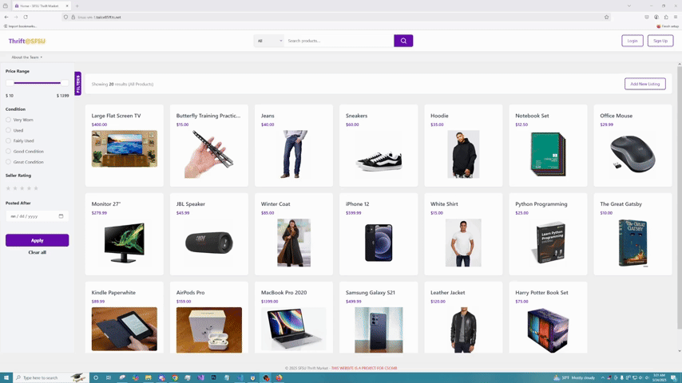

# ThriftAtSFSU - CSC 648 Semester Project Repository

## Website DEMO:
DEMO:

3. Fill out the table below
https://github.com/Hluii/ThriftAtSFSU/blob/main/WebsiteDEMO.gif

| Student Name | School Email | GitHub Username |
|    :---:     |     :---:     |     :---:       |
| Sid Padmanabhuni      |      spadmanabhuni@sfsu.edu        |         SidPad03        |
| Joseph Shur      |        jshur1@sfsu.edu       |           joseph-shur       |
|  Hilary Lui       |         hlui@sfsu.edu      |          Hluii       |
| Joseph Alhambra      |    jalhambra@sfsu.edu           |        JosephCVA         |
| Annison Van      |         avan@sfsu.edu      |          anvan882       |

## NO code needs to be stored in the root of your repository. You may rename the application folder if you like to your team's application name. But all source code related to your team's application should be stored inside the application folder.
